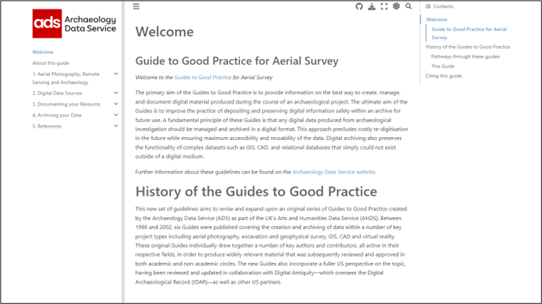

# Introduction

Welcome to the repository for the Guide to Good Practice for Aerial Survey. The guide and this repository is maintined by staff at the [Archaeology Data Service](https://archaeologydataservice.ac.uk/).

# About the guide

The primary aim of the Guides to Good Practice is to provide information on the best way to create, manage, and document digital material produced during the course of an archaeological project. The ultimate aim of the Guides is to improve the practice of depositing and preserving digital information safely within an archive for future use. Further information about the guides and their history can be found on the [homepage](https://nickyjgarland.github.io/g2gpap/index.html) of this Guide to Good Practice.

This document is intended to be a Guide to Good Practice for the creation and preservation of digital resources resulting from aerial photography (incorporating optical and infra-red imagery collected from an airborne platform), satellite and airborne remote sensing (using a variety of sensors), and archaeological interpretations made from such data sources. For further details please read ['About this guide'](https://nickyjgarland.github.io/g2gpap/content/0_about_guide.html) within the manual.

# Contributing to this guide

This guide is perodically updated to take into account changes in both aerial survey and digitial preservaion. We also encourage our community to contibute and improve these guides through their own knowldge and expertise. 

If you have a suggestion please open an issue within this Github repository. Documentation about how to undertaken this is provided in the [Github docs](https://docs.github.com/en/issues/tracking-your-work-with-issues/creating-an-issue). Before you open a new issue, please check if any of our [open issues](https://github.com/nickyjgarland/g2gpap/issues) cover your suggestions already. Alternatively if you are more comformble you can contact the ADS directly with your suggestion (see below).

# How to cite this guide

You can cite this guide using the project’s Zenodo archive using this DOI: https://10.5284/zenodo.??????. A full citation is provided below:

__Sample Citation for this DOI__

> Bob Bewley, Danny Donoghue, Vince Gaffney, Martijn van Leusen, Alicia Wise (1998). Revised by Bob Bewley and Kieron Niven, Archaeology Data Service / Digital Antiquity (2011), Guides to Good Practice. DOI: https://doi.org/10.5284/0000

Make sure to include the DOI in your citation for this guide. Digital Object Identifiers (DOIs) are persistent identifiers which can be used to consistently and accurately reference digital objects and/or content. The DOIs provide a way for the ADS resources to be cited in a similar fashion to traditional scholarly materials. More information on DOIs at the ADS can be found on our help page.

**Cite**  

All material in this guide is available open access under a CC-BY 4.0 licence.

# Get in Touch

If you have any questions about this guide or the repository please [contact](https://archaeologydataservice.ac.uk/contact/) the ADS Helpdesk (help@archaeologydataservice.ac.uk).

If you would like to learn more about the Archaeology Data Service please visit our [website]((https://archaeologydataservice.ac.uk/)). All the latest News can be found on our [News and Events](https://archaeologydataservice.ac.uk/news-events/) pages or the ADS Blog - [SoundBytes](https://archaeologydataservice.ac.uk/blog/). You can also sign up to recieve the [ADS Newsletter](https://archaeologydataservice.ac.uk/news-events/signup-ads-newsletter/), a quarterley online publication, or follow us via social media.

## Social Media channels
* ADS Twitter :bird: [@ADS_Update](https://twitter.com/ADS_Update)
* ADS Facebook :blue_book: [Archaeology Data Service](https://www.facebook.com/archaeology.data.service)
* ADS Instagram :star2: [@archaeologydataservice](https://www.instagram.com/archaeologydataservice/)
* ADS LinkedIn :link: [Archaeology Data Service](https://www.linkedin.com/company/archaeology-data-service/)
